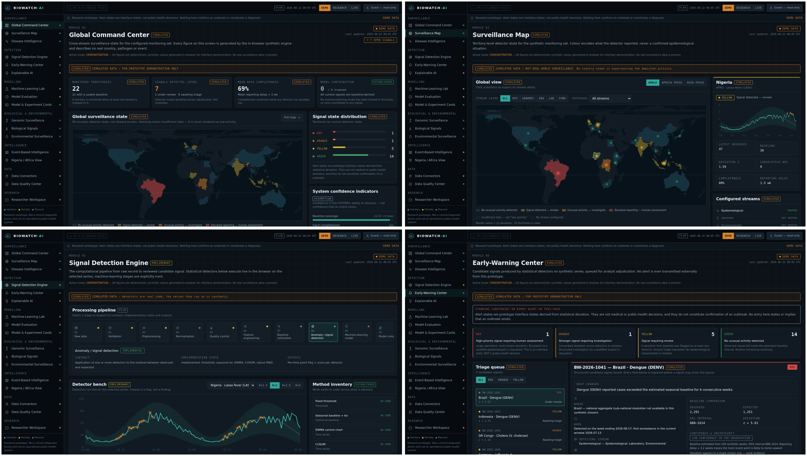
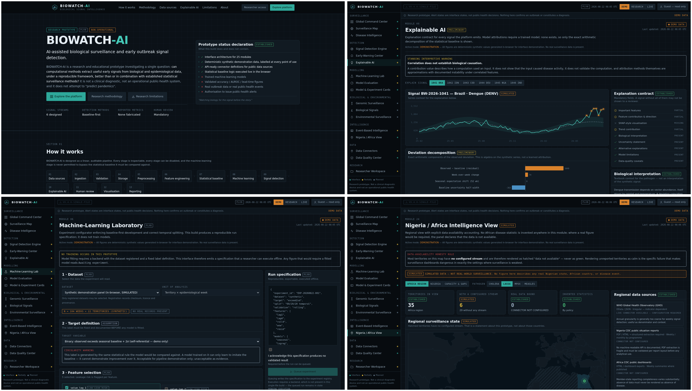

<p align="center">
  
</p>

<h1 align="center">BIOWATCH-AI</h1>

<p align="center">
  <strong>Autonomous Biological Signal Intelligence & Global Outbreak Anomaly Detection</strong><br>
  <em>A High-Assurance, Epistemically-Honest Research & Educational Computational Platform</em>
</p>

<p align="center">
  <a href="#live-demo"></a>
  <a href="#structural-honesty-rules"></a>
  <a href="#media--promotional-video"></a>
  <a href="#license"></a>
</p>

---

## ⚡ Executive Summary

**BIOWATCH-AI** is a futuristic biological surveillance and early outbreak signal detection platform designed for epidemiologists, biosecurity researchers, data engineers, and global health analysts. 

Built around the core tenet of **epistemic integrity**, BIOWATCH-AI addresses a critical pitfall in modern computational epidemiology: *overconfident black-box machine learning models operating in low-signal, high-noise surveillance regimes*. Rather than claiming fabricated predictions or premature outbreak confirmations, BIOWATCH-AI establishes a baseline-first mathematical architecture where statistical anomalies are rigorously distinguished from confirmed clinical diagnoses.

```
                          ┌────────────────────────────┐
                          │  Multi-Stream Ingestion   │
                          │ (Epi, Genomic, Env, Events)│
                          └─────────────┬──────────────┘
                                        │
                                        ▼
                          ┌────────────────────────────┐
                          │   Statistical Baselines    │
                          │ (CUSUM, EWMA, MAD, Poisson)│
                          └─────────────┬──────────────┘
                                        │
                                        ▼
                          ┌────────────────────────────┐
                          │  ML Anomaly Candidate Lab  │
                          │(Downstream - Inert by Dflt)│
                          └─────────────┬──────────────┘
                                        │
                                        ▼
                          ┌────────────────────────────┐
                          │ Human Adjudication & Triage│
                          │  "Signal Detected" Alert   │
                          └────────────────────────────┘
```

---

## 🎥 Media & Promotional Cinema Video

A high-definition advertising and product showcase video (`BIOWATCH-AI-promo.mp4`) is packaged directly within this repository:

- **Duration:** 51.8 seconds (1920×1080 Full HD, 30 fps, H.264 + AAC 192k)
- **Audio Master:** Original multi-layered cinematic electronic soundtrack with dynamic sub-bass impacts, riser tension sweeps, data ticks, and stereo transition whooshes.
- **Visuals:** 11 choreographed sequences featuring Ken Burns dynamic panning, cross-dissolve transitions, live statistical engine traces, explainable AI attribution breakdowns, and continental African surveillance telemetry.

👉 **Direct File Link:** [`media/BIOWATCH-AI-promo.mp4`](media/BIOWATCH-AI-promo.mp4)  
👉 **Asset Folder:** [`assets/`](assets/) (contains high-res transparent PNGs, SVGs, and feature contact sheets)

---

## 🖥️ Live Interface Preview & Screenshots

The primary interface is contained in a **zero-dependency, single-file architecture** (`index.html`) featuring 25 specialized modules rendered through pure HTML5, CSS3 tokens, inline vector SVG engines, and embedded geographic topology.

<p align="center">
  
</p>

<p align="center">
  
</p>

---

## 🏛️ Core Design Principles & Epistemic Rules

1. **Baseline Before Model:** No machine-learning model output is permitted to trigger a signal without an established statistical baseline (CUSUM, EWMA, 52-week Seasonal Confidence Bands, Robust MAD) evaluated under identical temporal splits.
2. **Strict Epistemic Tagging:** Every metric, card, and insight renders with mandatory categorization:
   - `ESTABLISHED` — Empirically verified ground truth or established biological principles.
   - `ASSUMPTION` — Underlying structural or operational assumptions.
   - `HYPOTHESIS` — Formulated research conjecture awaiting testing.
   - `PRELIMINARY` — Emerging observational data subject to reporting lag.
   - `PREDICTION` — Algorithmic projection with explicit uncertainty bounds.
   - `PLAN` — Planned methodological or operational step.
   - `SIMULATED` — Synthetically generated demonstration data.
3. **Constrained Outbreak Vocabulary:** The platform strictly prohibits declaring confirmed outbreaks. All signal triggers are restricted to:
   - `Signal detected`
   - `Unusual activity`
   - `Elevated reporting`
   - `Requires investigation`
   - `Evidence insufficient for confirmation`
4. **Data Availability Honesty:** Missing or sparse reporting is visually hatched and tagged `DATA NOT AVAILABLE` — it is **never** disguised as "green/calm".
5. **No Hallucinated Benchmarks:** Untrained candidate models display *"Awaiting experiment"* rather than misleading synthetic ROC-AUC or precision figures.

---

## 🗺️ 25 Integrated Platform Modules

| Category | Modules | Core Capabilities |
|---|---|---|
| **Surveillance Command** | Global Command Center<br>Surveillance Map<br>Disease Intelligence | Multi-stream aggregation, equirectangular world topology with zoom/pan, syndrome timeseries. |
| **Detection Engines** | Signal Detection Engine<br>Early-Warning Center<br>Explainable AI (XAI) | Parametric CUSUM, EWMA, 52-wk baseline filters, human triage queues, Shapley/arithmetic decomposition. |
| **Machine Learning Lab** | ML Research Lab<br>Model Evaluation Bench<br>Model & Experiment Cards | Temporal train/validation splitting, feature-leakage audit, standardised metadata cards. |
| **Multi-Omics & Biology** | Genomic Surveillance<br>Biological Signals<br>Environmental Feeds | Lineage frequency dynamics, QC ambiguity filtering, wastewater viral shedding, meteorological covariance. |
| **Regional Intelligence** | Nigeria / Africa View<br>Event-Based Intelligence | Sub-national state metrics, reporting-lag modeling, automated multi-tier news and public bulletin validation. |
| **Data & Governance** | Data Connectors (14 APIs)<br>Data Quality Center<br>Responsible AI & Security | Schema contracts (WHO, CDC, ECDC, GISAID), completeness heatmaps, append-only decision logs. |

---

## 🚀 Quick Start

### Option A: Instant Single-File Run (Recommended)
No build tools, no Node.js, and no Docker required. Open `index.html` directly in any web browser:
```bash
# Clone the repository
git clone https://github.com/ademmanlincoln07-crypto/biowatch-ai.git
cd biowatch-ai

# Open in browser
open index.html        # macOS
xdg-open index.html    # Linux
start index.html       # Windows
```

### Option B: Full Microservice Stack (Docker Compose)
To launch the full modular environment (FastAPI detection engine + Vite React client):
```bash
docker compose up --build
```
- **Web Frontend:** `http://localhost:8080`
- **FastAPI Detection Engine:** `http://localhost:8000`
- **API Documentation:** `http://localhost:8000/docs`

---

## 📁 Repository Structure

```
biowatch-ai/
├── index.html                       # Complete, self-contained single-file platform (v0.4.0)
├── world.compact.txt                # Vector country polygon topology (153 territories, 89 KB)
├── docker-compose.yml               # Container orchestration for dual-service stack
│
├── media/
│   └── BIOWATCH-AI-promo.mp4        # 51.8s Full HD cinematic advertising spot
│
├── assets/
│   ├── biowatch-logo.svg            # Scalable vector logo (DNA shield + pulse line)
│   ├── biowatch-logo.png            # High-resolution raster logo (1024x1024 transparent)
│   ├── biowatch-logo-transparent.png# Alpha-verified transparent mark
│   ├── dashboard-overview.png       # 1080p UI contact sheet (Command Center & Map)
│   ├── intelligence-overview.png    # 1080p UI contact sheet (XAI, ML Lab & Africa)
│   └── biowatch-collage.png         # Modular high-density feature board
│
├── docs/
│   └── FULL-SOURCE-ARCHITECTURE.md  # Comprehensive technical specification & architecture logs
│
├── src/
│   ├── backend/                     # FastAPI computational service
│   │   ├── app/
│   │   │   ├── main.py              # REST API endpoints (/api/detect, /api/health)
│   │   │   ├── detectors.py         # Pure NumPy implementation of CUSUM, EWMA, MAD
│   │   │   ├── connectors.py        # 14 Schema specifications for global health APIs
│   │   │   └── synth.py             # Deterministic PRNG time-series generator
│   │   ├── requirements.txt
│   │   └── Dockerfile
│   │
│   └── frontend/                    # Modular React 19 + Vite + Tailwind frontend
│       ├── src/
│       │   ├── pages/               # Modular views corresponding to platform engines
│       │   ├── components/          # Reusable scientific UI components
│       │   └── lib/                 # Client-side analytics & state store
│       ├── package.json
│       └── Dockerfile
│
└── .github/
    └── workflows/
        └── pages.yml                # Automatic GitHub Pages CI/CD deployment
```

---

## 🔒 Scientific Governance & Responsible AI

> **IMPORTANT DISCLAIMER**  
> BIOWATCH-AI is an educational and research prototype. It is **not** a certified medical device, does not provide clinical diagnostic guidance, and must not be used as the sole basis for operational public health quarantines or official disease declarations. Correlation does not establish biological causation. All analytical models require human-in-the-loop expert epidemiological assessment.

---

## 📄 License

This project is open-sourced under the **Research-Use Only** MIT-derivative terms for academic and biosecurity transparency. See the [LICENSE](LICENSE) file for details.
